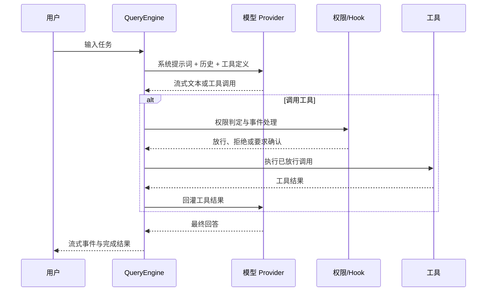

# 第一章：Agent 执行循环

> 本章对应 [项目简介](intro.md) 的“1. Agent 执行循环”。它解释 OpenHarness 如何把一次自然语言请求变成可持续推进、可调用工具、可被约束的执行过程。

## 1. 为什么需要执行循环

普通聊天模型一次只返回文本；代码任务却通常包含“查看文件 → 修改代码 → 运行测试 → 根据结果继续处理”的多步过程。OpenHarness 的 Agent Loop 将这些步骤组织为受控循环：模型负责决定下一步，Harness 负责提供上下文、执行工具、应用权限规则并记录结果。

适合代码排查、重构、文档生成、测试验证等需要多轮观察和行动的任务。若任务只要求直接回答，循环可以在首个模型回合结束。

## 2. 参与者与数据

核心对象是 `src/openharness/engine/query_engine.py` 中的 `QueryEngine`。它持有：

- **系统提示词与模型配置**：定义行为边界、当前模型、最大输出 Token 与推理强度；
- **会话消息**：`_messages` 保存用户、助手和工具结果构成的对话历史；
- **工具注册表**：向模型暴露可调用工具及其输入结构；
- **权限检查器与 Hook 执行器**：在真实操作前执行治理策略；
- **成本跟踪器**：累计各回合 Token 用量；
- **工具元数据**：承载任务目标、已读文件、异步 Agent 等会话级辅助状态。

## 3. 端到端流程

每次工具结果都会作为后续模型回合的输入，因此模型能基于真实的文件内容、命令输出或用户回答继续推进，而不是凭空假设操作已完成。

## 4. 实现原理

`QueryEngine` 是会话所有者，而实际单次运行由 `src/openharness/engine/query.py` 的查询逻辑协调。循环在每个 Agentic turn 中请求支持流式消息的 API client；流被转换为文本增量、工具开始/完成、压缩进度及完成事件，供 CLI 或 UI 呈现。

当模型请求工具时，运行时以工具名称定位注册项，先检查调用的只读属性、路径或命令信息。权限通过后才会执行，并将结构化结果写回消息历史。这样模型的“下一步”始终建立在可追溯的结果上。

循环不是无限的：`max_turns` 限制一次用户请求的工具—模型往返次数，达到上限会抛出 `MaxTurnsExceeded`。网络或 Provider 调用可配合重试、指数退避处理瞬时故障；`CostTracker` 聚合用量，便于观察成本。长会话接近阈值时，还可接入压缩和会话记忆机制，详见[第五章](chapter5.md)。

## 5. 使用时应关注什么

- 清晰描述目标、范围和验收方式，能减少无效回合；
- 工具输出是模型决策依据，失败输出也应保留并据实处理；
- 最大回合数是防止失控循环的护栏，不代表任务一定完成；
- 权限拒绝或用户未确认的调用不会被“自动补做”；
- 流式显示的是过程，最终是否完成仍应通过测试、文件状态等证据验证。

## 6. 源码入口与延伸阅读

- `src/openharness/engine/query_engine.py`：会话、配置、成本与记忆生命周期；
- `src/openharness/engine/query.py`：单次查询、回合限制与工具结果处理；
- `src/openharness/engine/messages.py`：会话消息与工具结果的数据结构；
- `src/openharness/engine/stream_events.py`：面向 UI/CLI 的流式事件。

模型后端如何统一接入见[第二章](chapter2.md)，工具能力见[第三章](chapter3.md)，执行前后的约束机制见[第六章](chapter6.md)。
