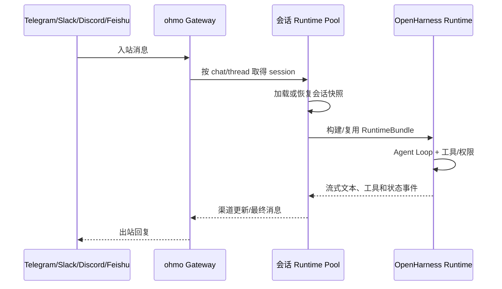

# 第十章：`ohmo` 个人 Agent 应用

> 本章对应 [项目简介](intro.md) 的“10. `ohmo` 个人 Agent 应用”。`ohmo` 建立在 OpenHarness 核心之上，是带独立 workspace、个人记忆和多渠道 Gateway 的应用层，而不是核心的一种简单运行模式。

## 1. 应用定位

核心 OpenHarness 关注通用 Agent 运行时：模型、工具、上下文、治理和协作。`ohmo` 在此基础上补齐个人助理的产品结构：初始化独立 workspace，保存人格/身份/用户资料和个人记忆，维护跨消息渠道的会话，并以 Gateway 守护服务接入 Telegram、Slack、Discord、Feishu 等渠道。

这种分层使核心能力保持通用，而应用层可以为“个人长期使用、多渠道收消息、保留私人偏好”设计特定数据模型和运行规则。

## 2. 组成部分

- `ohmo/workspace.py`：初始化 workspace，定位 skills、plugins、memory、sessions 等目录；
- `ohmo/prompts.py`、`ohmo/memory.py`：构造个人人格/记忆相关上下文；
- `ohmo/session_storage.py`：存取会话快照；
- `ohmo/runtime.py`、`ohmo/cli.py`：本地运行入口；
- `ohmo/gateway/`：长驻服务、路由、配置、桥接和渠道侧通知；
- `src/openharness/channels/`：通用渠道接入能力。

## 3. 从消息到回复的流程

## 4. 实现原理

`OhmoSessionRuntimePool` 的核心职责是“每个聊天或线程会话一份运行时”。它以 `session_key` 为键维护 `RuntimeBundle`：已有 bundle 且工作目录未变化时复用，并更新当前系统提示词；没有 bundle 时先从 `OhmoSessionBackend` 加载快照，再调用核心 `build_runtime` 创建运行时、恢复消息和工具元数据，最后启动 runtime。

构建时，ohmo 向核心运行时注入自己的系统提示词、独立记忆后端、会话目录、额外 Skill 目录与插件根目录，同时选择 provider profile。这样底层仍使用统一的 QueryEngine、工具注册和权限机制，但个人 workspace 中的身份、记忆和渠道会话与普通项目上下文隔离。

Gateway 层负责把渠道入站事件归一化、寻找会话、处理渠道范围命令及把流式事件转换为出站更新。它不是“直接把聊天消息交给模型”：会话恢复、管理员命令开关、渠道格式和附件处理都在应用层控制。

## 5. 配置、安全与运行边界

- 每个 workspace 的个人资料、记忆、sessions、plugins 和 skills 应有清晰的备份/访问控制；
- 渠道 token、Webhook 密钥和 provider 凭据必须通过受保护的配置或认证存储管理，不能出现在提示词和日志中；
- 远程管理命令应显式 opt-in，并配置允许列表；
- 多渠道会话复用需以 chat/thread 标识为边界，避免上下文串线；
- Gateway 长驻不等于无限权限：每个工具调用仍受核心权限和沙箱策略约束；
- 接入外部 IM 前还要考虑组织权限、消息留存、隐私和平台规则。

## 6. 源码入口与关联章节

- `ohmo/gateway/runtime.py`：按会话构建、恢复和复用运行时；
- `ohmo/gateway/service.py`、`router.py`、`bridge.py`：Gateway 服务和消息路由；
- `ohmo/workspace.py`、`memory.py`、`session_storage.py`：个人数据边界；
- `src/openharness/channels/`：渠道基础设施。

底层 Agent Loop 见[第一章](chapter1.md)，持久记忆见[第五章](chapter5.md)，多渠道运行仍必须应用[第六章](chapter6.md)的治理机制。
