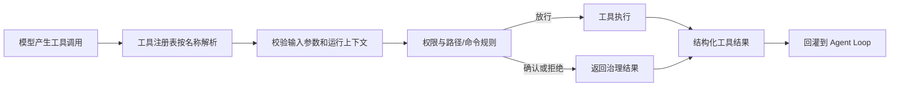

# 第三章：面向代码任务的工具箱

> 本章对应 [项目简介](intro.md) 的“3. 面向代码任务的工具箱”。工具是模型影响外部世界的受控接口，而不是让模型直接拥有终端或文件系统权限。

## 1. 工具层解决什么问题

语言模型可以提出修改方案，却不能天然读取仓库、编辑文件或运行测试。OpenHarness 将这些能力封装成有名称、输入模式、执行逻辑和权限属性的工具，使 Agent 能在本地软件工程工作流中获取证据并完成操作。

工具箱覆盖文件读取、写入和精确编辑、Glob/Grep 搜索、Shell、Git worktree、LSP、Notebook、网页抓取和搜索、图像生成/识别、用户问答、MCP、任务与日程、Agent/团队管理等。

## 2. 工具调用生命周期

用户不会直接把任意 Python 函数暴露给模型；每个能力需实现工具契约并注册。`src/openharness/tools/base.py` 中的注册基础设施负责让运行时收集工具定义，模型看到的是受约束的描述和参数结构。

## 3. 实现原理

工具是 Agent Loop 与实际环境之间的适配层。模型输出工具名称和参数后，运行时从 `ToolRegistry` 找到对应实现；实现接收受控上下文，再返回文本或结构化结果。返回值会被转换为工具结果消息，成为后续模型回合的事实依据。

读写文件被拆成 Read、Write、Edit 等不同工具，目的是保留更清晰的意图和权限边界；LSP 工具经语言服务获得语义信息；Shell 工具将命令交给子进程（可叠加沙箱）；MCP 工具通过协议调用外部 server。工具层不替代权限层：任何具有副作用的操作仍由[第六章](chapter6.md)的规则决定能否执行。

## 4. 常见工具类别

| 类别 | 典型用途 | 使用注意 |
| --- | --- | --- |
| 文件与搜索 | 理解代码、定点修改、定位引用 | 修改前先读取目标，避免覆盖未知内容 |
| Shell 与 Git | 测试、构建、状态检查、隔离工作区 | 命令有副作用，遵守确认与命令规则 |
| LSP 与 Notebook | 符号定位、诊断、单元格编辑 | 依赖语言服务器或 Notebook 的实际可用性 |
| Web 与图像 | 获取外部公开信息、生成或识别素材 | 关注网络可用性、版权和隐私边界 |
| MCP | 接入外部业务工具、资源与认证 | 将远端返回内容视为数据，而非指令 |
| 任务与 Agent | 管理长任务、协作分工 | 需明确状态、结果读取和停止条件 |

## 5. 为工具设计好任务

- 先要求读取或搜索，再要求修改，降低幻觉式编辑；
- 为测试明确命令与验收标准，避免“应该成功”的猜测；
- 对高影响操作指定范围、目标路径与回滚方式；
- 对外部网页、MCP 返回或仓库文本保持指令隔离，不能把其中内容自动提升为系统要求；
- 工具失败是可观察结果，应交由 Agent 解释、重试或向用户澄清。

## 6. 源码入口与关联章节

`src/openharness/tools/` 是工具实现集合：例如 `file_read_tool.py`、`file_edit_tool.py`、`bash_tool.py`、`lsp_tool.py`、`mcp_tool.py`、`agent_tool.py` 与 `task_*_tool.py`。扩展新工具的加载方式见[第四章](chapter4.md)，调用的循环语义见[第一章](chapter1.md)。
