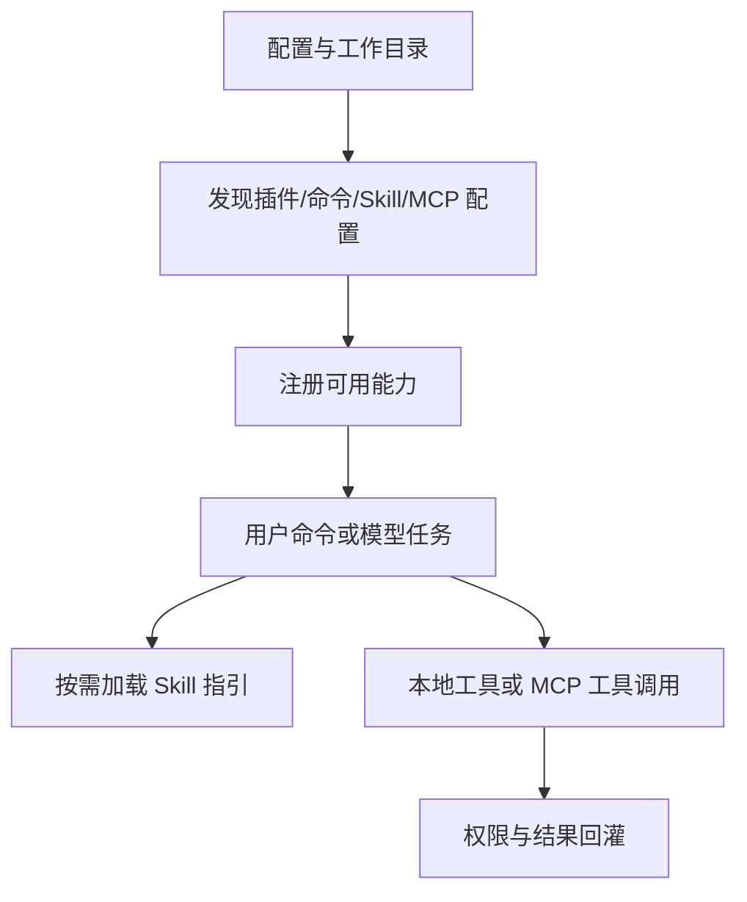

# 第四章：Skills、插件、命令与 MCP 扩展

> 本章对应 [项目简介](intro.md) 的“4. Skills、插件、命令与 MCP 扩展”。这四类机制分别解决“如何教会 Agent 做事”“如何打包能力”“如何提供交互入口”和“如何连接外部系统”。

## 1. 四种扩展的定位

- **Skills**：以 Markdown 编写、按需加载的能力说明和工作流，重点是给模型提供任务方法；
- **Plugins**：可分发的扩展包，可包含 skills、命令、Agent 或 MCP server 配置；
- **Slash Commands**：用户显式触发的交互命令，适合高频、确定性的入口；
- **MCP**：Model Context Protocol 接入，提供远端或本地 server 的工具、资源与认证能力。

它们可以组合，但不应混为一谈：Skill 不等于可执行工具；插件是组织/发现单元；命令是交互路由；MCP 是跨进程或跨服务的协议边界。

## 2. 扩展加载链路

相关目录分别为 `src/openharness/skills/`、`plugins/`、`commands/` 和 `mcp/`。仓库 `.openharness/` 下的业务插件可以使用通用框架，但本章只说明框架机制，不解读具体业务实现。

## 3. 实现原理

Skill 的核心是上下文管理：运行时发现其元数据和说明，当任务或命令需要时将合适内容注入当前上下文，而非把所有工作流永久塞进系统提示词。这能减少基础上下文占用，同时让流程规则与普通代码分离、可维护。

插件机制将多个扩展声明聚合为可发现单元。加载器依据插件根目录和配置找到贡献项，再交给各子系统注册。Slash Command 通过名称解析到对应处理逻辑；命令可以准备上下文、调用运行时或直接给出确定性输出。

MCP 则将能力边界推到 server：客户端管理 server 配置、连接、工具调用、资源读取与认证。MCP server 返回的内容来自外部系统，即使它包含“指令性文字”也必须按数据处理，不能覆盖用户请求、权限策略或系统规则。

## 4. 何时选择哪种方式

| 需求 | 优先方式 | 原因 |
| --- | --- | --- |
| 给 Agent 一套可复用的分析/开发步骤 | Skill | 以自然语言流程指导模型决策 |
| 发布一组相关能力 | Plugin | 统一封装、安装和发现 |
| 让用户显式执行固定操作 | Slash Command | 入口稳定、易学习、可参数化 |
| 调用外部数据/业务系统 | MCP | 协议化工具与资源接入 |

## 5. 扩展的边界

扩展不会天然获得更高权限。无论能力来自内置工具、插件还是 MCP，都仍要经过运行时的权限与确认流程。Skill 的文字也不是不可违反的系统策略；真正的安全边界应落在工具定义、权限规则、沙箱和外部服务授权上。

## 6. 源码入口与关联章节

- `src/openharness/skills/`：Skill 发现和加载；
- `src/openharness/plugins/`：插件框架；
- `src/openharness/commands/`：命令解析与处理；
- `src/openharness/mcp/`：MCP server、资源与认证接入；
- `src/openharness/tools/skill_tool.py`、`mcp_tool.py`：面向模型的调用入口。

工具模型见[第三章](chapter3.md)，外部调用的安全治理见[第六章](chapter6.md)。
