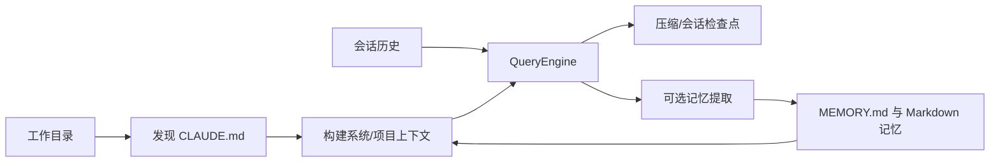

# 第五章：项目上下文、会话与持久记忆

> 本章对应 [项目简介](intro.md) 的“5. 项目上下文、会话与持久记忆”。目标是在“记得当前对话”和“积累长期项目知识”之间建立可控分层。

## 1. 三类状态不应混淆

1. **项目上下文**：如 `CLAUDE.md`，描述仓库规范、约束和工作方式；
2. **会话状态**：当前对话的消息、工具结果、任务焦点和临时元数据；
3. **持久记忆**：跨会话仍有价值的事实，通常由 `MEMORY.md` 与关联 Markdown 文件维护。

区分它们的原因是生命周期不同：会话消息适合即时推理，项目规范必须稳定加载，长期记忆则需要谨慎提炼，避免把每一次临时尝试都永久化。

## 2. 数据流

## 3. 实现原理

`QueryEngine` 在内存中维护 `_messages`，每一回合的用户输入、助手消息与工具结果都会进入这一序列。随着上下文增长，运行时可依据 Token 阈值进行压缩；压缩并非删除事实的保证，而是用摘要换取上下文容量，因此关键验收证据仍应保留或重新读取。

`src/openharness/services/session_memory/` 为会话提供文件化检查点：在启用相关设置时，运行前准备元数据，用户回合后更新会话文件，从而支持恢复。`src/openharness/services/memory_extract/` 则是可选的后处理：它从一轮对话中提取候选长期事实并写入记忆体系。`autodream/` 负责后台的记忆整合类工作。

文件持久化必须面对并发和异常中断。cron 和记忆等模块复用文件锁及原子写入模式：先在受保护范围内更新，再以原子替换降低半写入文件的风险。这不等于解决所有语义冲突，因此记忆仍需保持简短、可核验、避免重复。

## 4. 使用建议

- 在 `CLAUDE.md` 中放置稳定的工程规范，不要记录会话进度；
- 将长期记忆写成一个事实一个文件或条目，标明适用条件；
- 不把密钥、隐私内容和容易过期的临时状态写入持久记忆；
- 对自动提取结果进行审阅，它是辅助能力而非无误知识库；
- 恢复会话后仍应通过 Git 状态、测试结果和文件内容确认真实世界状态。

## 5. 源码入口与关联章节

- `src/openharness/prompts/`：项目说明和运行时提示词构建；
- `src/openharness/memory/`：持久记忆组织；
- `src/openharness/services/session_memory/`、`session_storage.py`：会话保存与恢复；
- `src/openharness/services/memory_extract/`、`autodream/`：自动提取与整合；
- `src/openharness/utils/file_lock.py`、`utils/fs.py`：锁与原子写入工具。

状态会被[第一章](chapter1.md)的循环消费；ohmo 如何使用独立个人记忆见[第十章](chapter10.md)。
