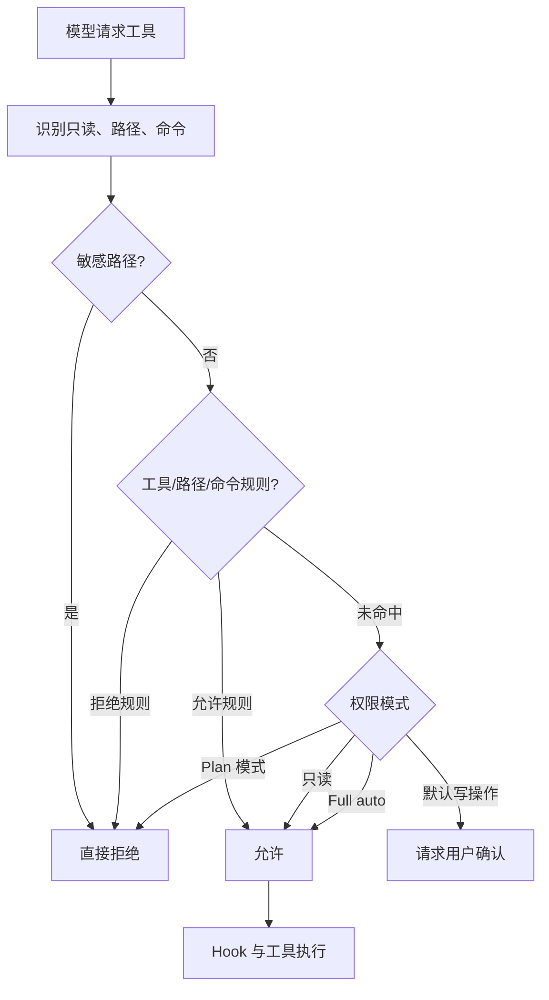

# 第六章：权限治理、Hook 与沙箱

> 本章对应 [项目简介](intro.md) 的“6. 权限治理、Hook 与沙箱”。Harness 的价值不仅是让模型能执行，更是让执行有明确边界、可解释且可审查。

## 1. 治理层的三道防线

- **权限治理**：判断某一次工具调用是允许、拒绝还是必须由用户确认；
- **Hook**：在运行生命周期的关键事件上插入检查、审计或自定义处理；
- **沙箱**：限制子进程可访问的网络、文件系统或运行资源。

三者解决不同问题：权限决定“是否应该执行”，Hook 负责“在什么节点附加规则”，沙箱限制“即使执行后最多能触及什么范围”。它们应叠加，而不是互相替代。

## 2. 权限决策流程

`PermissionChecker` 的结果包含 `allowed`、`requires_confirmation` 和 `reason`，因此 UI 可向用户展示为何操作被拦截或为何需要批准。

## 3. 实现原理

`src/openharness/permissions/checker.py` 先对高价值凭据路径应用不可覆盖的内建拒绝规则，例如 SSH、云凭据、Docker/Kubernetes 配置及 OpenHarness 自身凭据存储。接着处理显式工具允许/拒绝、路径 Glob 规则和命令拒绝模式。只有这些规则没有决定结果时，才根据权限模式处理：只读工具可直接执行，Plan 模式阻止写操作，默认模式要求确认，full auto 放行。

Hook 系统位于 `src/openharness/hooks/`，由事件定义、加载、执行和热重载组成。它让部署者能在工具调用或会话事件附近加入一致化行为，但 Hook 本身也属于执行路径，应设计成失败可见、输入输出明确，避免隐式修改任务语义。

沙箱层提供运行环境的额外约束。`sandbox/adapter.py` 会依据设置和平台能力判断 sandbox runtime 是否可用；可用时生成临时策略文件，将网络允许/拒绝域名、文件读写允许/拒绝路径传给 `srt` 包装子进程。若配置为 Docker 后端，则由 Docker 实现隔离。启用了“不可用即失败”时，缺少运行时不会静默降级。

## 4. dry-run 的意义与限制

`oh --dry-run` 的职责是静态预检：解析配置、认证、提示词、Skills、命令、工具与 MCP 配置，并给出 `ready`、`warning` 或 `blocked`。它**不**调用模型、不执行工具、不启动 subagent，也不连接 MCP server。因此 dry-run 能提前发现配置问题，却不能证明远端服务、真实权限确认或业务操作一定成功。

## 5. 配置与操作边界

- 默认确认机制优先保护有副作用的操作；
- “允许某工具”不应理解为绕过敏感路径保护；
- 沙箱限制需要与实际平台能力、安装状态和配置一起验证；
- Hook 与 MCP 的外部输入都应视为不可信数据；
- 高风险操作还应保留 Git、备份、审计日志和人工复核等工程控制。

## 6. 源码入口与关联章节

- `src/openharness/permissions/checker.py`、`modes.py`：规则与模式判定；
- `src/openharness/hooks/events.py`、`executor.py`、`loader.py`：Hook 生命周期；
- `src/openharness/sandbox/adapter.py`、`docker_backend.py`：沙箱后端；
- `src/openharness/cli.py`：dry-run 等 CLI 集成。

权限判定发生在[第三章](chapter3.md)的工具生命周期中；多 Agent 的权限同步见[第七章](chapter7.md)。
