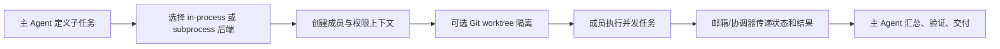

# 第七章：多 Agent 协作与后台任务

> 本章对应 [项目简介](intro.md) 的“7. 多 Agent 协作与后台任务”。它将大任务拆成可分工、可观察、可停止的工作单元，但不会自动消除协调成本。

## 1. 两类并发能力

- **Subagent/团队协作**：一个主 Agent 派生多个角色，分别研究、实现或验证，再通过消息和结果汇合；
- **后台任务**：让 Shell 命令或本地 Agent 异步运行，调用方继续工作，并在之后读取结果或停止任务。

前者强调任务分工和沟通，后者强调长时操作的生命周期管理。两者都需要显式状态，不能以“没有报错”代替完成证据。

## 2. 协作流程

## 3. 实现原理

`src/openharness/swarm/` 将协作概念拆开实现：`registry.py` 维护注册信息，`in_process.py` 和 `subprocess_backend.py` 提供不同执行后端，`mailbox.py` 负责成员间消息，`permission_sync.py` 同步必要的权限上下文，`worktree.py` 提供 Git 隔离支持。

`team_lifecycle.py` 将团队元数据持久化为 JSON。成员记录 Agent ID、后端、模型、工作目录、状态、会话标识和可选 worktree 路径；这样 UI 或协调器能区分 active、idle、stopped 等生命周期状态，而不只依赖进程是否存在。

后台任务由 `src/openharness/tasks/` 管理。`LocalShellTask` 和 `LocalAgentTask` 将不同任务类型统一为可查询的状态/结果模型，`manager.py` 负责创建与查询，`stop_task.py` 提供停止控制。结果应该通过任务输出接口读取，而不是假设后台日志自动进入主对话。

## 4. worktree 为什么重要

多个 Agent 在同一工作目录修改同一文件会产生竞争、覆盖和难以归因的问题。worktree 为成员提供基于同一 Git 仓库的独立工作目录，可将变更隔开；但它不解决语义冲突，主 Agent 仍需选择、合并和测试各成员产物。

## 5. 协作实践

- 将任务拆成输入、预期输出和验收标准明确的单元；
- 用“探索、实现、验证”等不同角色减少重复劳动；
- 让每个 Agent 报告实际改动、测试命令和失败项；
- 对共享文件使用 worktree 或串行化策略；
- 停止后台任务后检查退出状态和部分产物，避免遗留进程或误判成功；
- 权限同步不代表扩大权限，成员仍受运行时治理约束。

## 6. 源码入口与关联章节

- `src/openharness/swarm/in_process.py`、`subprocess_backend.py`：执行后端；
- `src/openharness/swarm/mailbox.py`、`registry.py`、`team_lifecycle.py`：通信和生命周期；
- `src/openharness/swarm/worktree.py`：隔离工作区；
- `src/openharness/tasks/manager.py`、`local_shell_task.py`、`local_agent_task.py`：后台任务。

底层执行循环见[第一章](chapter1.md)，治理规则见[第六章](chapter6.md)，周期性自动化见[第九章](chapter9.md)。
