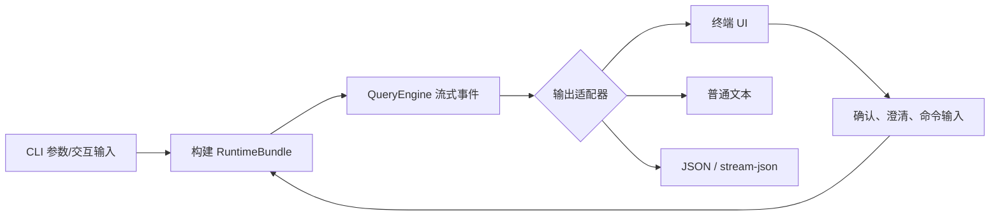

# 第八章：CLI、终端 UI 与自动化输出

> 本章对应 [项目简介](intro.md) 的“8. CLI、终端 UI 与自动化输出”。同一个 Agent 内核可以面向人交互，也可以嵌入脚本和 CI。

## 1. 多种交付形态

OpenHarness 通过 `oh` 命令行入口提供交互式会话与单次 Prompt 执行；终端 UI 负责将流式文本、工具事件、确认请求和状态信息呈现给人；JSON 与 stream-json 输出则为脚本、IDE 集成和 CI 提供机器可消费的协议。

此外，项目提供主题、输出风格、键绑定、Vim 模式和语音输入相关能力。它们改变交互体验或输入输出表达，而不改变 Agent Loop 的基本语义。

## 2. 数据从运行时到界面

## 3. 实现原理

`src/openharness/cli.py` 是入口编排层：解析命令行参数和模式，加载配置，构建运行时，并选择交互或非交互输出路径。运行时不应将 UI 逻辑塞进模型循环；`QueryEngine` 产生的是 `AssistantTextDelta`、工具开始/结束、状态、错误和完成等流式事件，前端或 CLI 再将这些事件渲染为适合目标消费者的格式。

`src/openharness/ui/` 处理 Python 侧交互运行时，`frontend/terminal/` 承载 React 终端 UI。键绑定、主题、输出样式和 Vim 行为被拆到独立目录，使显示偏好可配置而不污染执行内核。JSON 输出将事件序列化给外部程序；消费者应按事件类型处理，不应把格式化的人类文本当作稳定 API。

## 4. 选择正确的模式

| 场景 | 推荐接口 | 关注点 |
| --- | --- | --- |
| 人工结对开发 | 交互式 CLI/TUI | 需要处理确认、澄清和流式过程 |
| 一次性脚本任务 | 非交互 Prompt | 明确输入、退出码和结果采集 |
| CI/编排系统 | JSON 或 stream-json | 用事件和状态判断结果，不依赖终端颜色 |
| 个性化终端操作 | 主题/键绑定/Vim | 不改变权限与执行限制 |

## 5. 自动化边界

非交互输出不代表自动批准所有副作用。权限模式、认证、网络和沙箱仍会影响执行。CI 场景应明确设置可用的认证、工作目录、输出解析和失败策略，并通过 dry-run 或小范围任务验证配置。语音输入也只是输入通道，需要继续遵守同一套权限与任务确认机制。

## 6. 源码入口与关联章节

- `src/openharness/cli.py`：命令行入口与模式选择；
- `src/openharness/ui/`、`frontend/terminal/`：终端 UI；
- `src/openharness/engine/stream_events.py`：流式事件模型；
- `src/openharness/keybindings/`、`themes/`、`output_styles/`、`vim/`、`voice/`：交互扩展。

事件的生产过程见[第一章](chapter1.md)；自动触发运行见[第九章](chapter9.md)。
