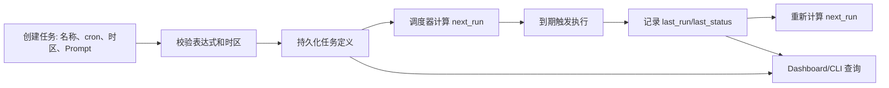

# 第九章：定时调度与仓库自动化

> 本章对应 [项目简介](intro.md) 的“9. 定时调度与仓库自动化”。它面向“在未来或周期性地触发任务”的场景，将调度定义、执行状态和可视化分开管理。

## 1. 能力范围

OpenHarness 包含 Cron 任务创建、启停、查询、执行历史与日志能力；同时提供调度器守护进程、仓库 Autopilot 服务及 Dashboard 前端。典型用途包括定期检查、日报生成、仓库维护或需要在无人值守时触发的 Agent 工作流。

## 2. 调度生命周期

## 3. 实现原理

`src/openharness/services/cron.py` 是本地 Cron 注册表的基础。它读取/写入任务 JSON，利用 `croniter` 校验 cron 表达式并计算下一次执行时间；有时区时先在指定 IANA 时区解释表达式，再统一转换为 UTC。创建或更新任务时，模块设置默认启用状态、创建时间和 `next_run`；执行完成后，`mark_job_run` 更新 `last_run`、`last_status` 并重算下一次时间。

注册表写入使用独占文件锁与原子写入，降低多个命令或调度器同时改写时损坏文件的概率。`cron_scheduler.py` 在此基础上轮询/触发到期任务；具体任务执行可驱动 Agent 运行时。`autopilot/` 组织仓库自动化服务，Dashboard 提供观察和操作界面。

## 4. 调度设计要点

- 名称应稳定且唯一，便于更新、禁用和追踪；
- cron 表达式与时区必须一起考虑，尤其是夏令时和跨时区团队；
- Prompt 要说明目标、允许范围、输出位置和失败处理；
- 应记录成功与失败，而非仅记录“曾触发”；
- 幂等任务优先：重复执行不应破坏仓库或重复发送外部内容；
- 将耗时工作拆到可监控后台任务，避免调度器被单个任务长期阻塞。

## 5. 运行边界与安全

定时任务不会因无人值守而绕过认证、权限、工具规则或沙箱。自动化前应确认凭据的可用性、目标工作目录、网络依赖和审批策略。对于修改代码、发布消息或调用外部系统的计划任务，建议限制权限范围、使用 dry-run 预检、保留日志并建立人工复核/停用机制。

Dashboard 展示的是控制与观测界面，不应被视为任务已正确完成的唯一证据；仍需检查执行输出、退出状态和最终产物。

## 6. 源码入口与关联章节

- `src/openharness/services/cron.py`：任务注册、校验、时间计算和状态更新；
- `src/openharness/services/cron_scheduler.py`：调度器；
- `src/openharness/autopilot/`：仓库自动化服务；
- `autopilot-dashboard/`：Dashboard 前端；
- `src/openharness/tools/cron_*_tool.py`：模型可调用的 Cron 管理入口。

后台任务与协作控制见[第七章](chapter7.md)，人机/机器输出接口见[第八章](chapter8.md)。
